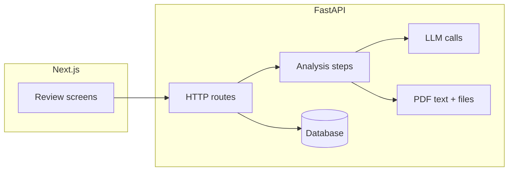

# RxEvidence

**Turn a clinical trial PDF into a structured review a pharmacist can actually check.**

You upload a trial PDF. The app pulls out findings, PICO, risks and limitations, and a short summary. Each item is labeled, includes stats when the paper reports them, and links back to **the exact quotes** in the PDF so a human can verify before trusting it.

---

## The problem I’m solving

Clinicians are right to be skeptical of AI summaries. If you cannot see **where** a claim came from, you cannot use it in care decisions. RxEvidence is built so the **source text stays visible** next to the structured output, and so bad model output **does not get saved as if it were true**—it fails checks first and gets logged for debugging.

---

## What the app does

- **Four review tabs** — Findings, PICO, risk & limitations, and summary. Same data shapes in the API and the UI so nothing gets “lost in translation.”
- **Pick your model vendor** — Gemini, Anthropic, or OpenAI via one switch in config (`api/.env`). Same code path; you change the key and provider name.
- **PDF handling that survives restarts** — Text is extracted and split into sections in Python; PDFs are cached on disk so a retry after a crash does not start from zero.
- **A real API + database** — FastAPI and SQLAlchemy. SQLite locally; you can point at Postgres with `DATABASE_URL` when you deploy.
- **A reviewer-focused Next.js UI** — Resizable layout, tabs, and clear “not reported” states instead of guessing numbers the paper never gave.

---

## How the pieces connect



**Start here:** run **Next.js** (`rx-evidence-next/`) against the **Python API** (`api/`). The older **Vite + Express** stack (`client/`, `server/`) is still in the tree if you want to compare approaches; the Next + FastAPI path is the one I’d show in an interview.

---

## Tech stack

| Area | What I used |
|------|----------------|
| API | Python, FastAPI, Pydantic, SQLAlchemy, Uvicorn |
| Models | Google, Anthropic, and OpenAI official SDKs (one active at a time) |
| PDF | PyMuPDF, pdfplumber |
| Main UI | Next.js 14, React, TypeScript, Tailwind |
| Older UI | Vite, React, small Express helper |

---

## What’s in each folder

| Path | What lives there |
|------|------------------|
| `api/` | API, database models, analysis flow, LLM wiring |
| `rx-evidence-next/` | The Next.js app I’d point employers to |
| `client/` / `server/` | Earlier UI + Node bridge (optional) |
| `docs/` | Prompts, example JSON contracts, and `build-journey.md` (how and why I built it) |

---

## Quick start (Next.js + FastAPI)

### 1. Backend

```bash
cd api
python -m venv .venv
source .venv/bin/activate   # Windows: .venv\Scripts\activate
pip install -r requirements.txt
cp .env.example .env        # add the API key for the provider you turn on
uvicorn app.main:app --reload --host 0.0.0.0 --port 8000
```

Check: open `http://localhost:8000/health`.

### 2. Frontend

```bash
cd rx-evidence-next
npm install
export NEXT_PUBLIC_API_BASE_URL=http://localhost:8000   # optional; this is already the default
npm run dev
```

Then open the URL Next prints (usually `http://localhost:3000`).

### 3. Legacy stack (optional)

From the repo root:

```bash
npm install
npm run dev
```

---

## Deploy on Render (API + web + Postgres)

This repo includes a **`render.yaml`** Blueprint so you can run the **FastAPI** app, **Next.js** app, and a **free Postgres** instance in one Render project.

1. Push this repository to GitHub (if it is not already).
2. In [Render](https://dashboard.render.com): **New → Blueprint** → connect the repo → leave the default path `render.yaml` → apply.
3. When prompted, paste **`GEMINI_API_KEY`** (or switch `LLM_PROVIDER` and keys on the API service after deploy—see `api/.env.example`).
4. Wait for all three resources to go **Live**. Open the **web** URL (for example `https://rx-evidence-web.onrender.com`).

**URLs:** The Next build expects the API at **`https://rx-evidence-api.onrender.com`**. That matches the API service name `rx-evidence-api` in `render.yaml`. If you rename the API service in Render, set **`NEXT_PUBLIC_API_BASE_URL`** on the web service to the new API URL and **redeploy the web service** so the client bundle rebuilds.

**Free tier behavior:** Web services **spin down after idle** (cold start on the next visit). Render’s **free Postgres** databases are **time-limited**; upgrade or export data before they expire. Uploaded PDFs live on **ephemeral disk** unless you add a paid disk—fine for demos, not for long-term storage.

**“Try the demo”:** On first boot the API **loads a bundled, pre-analyzed** PARADIGM-HF trial (`NEJMoa1409077.pdf`) into the database and PDF cache when **`AUTO_SEED_DEMO`** is left at its default (`true`). `render.yaml` sets **`DEMO_PAPER_ID`** to that paper’s UUID so the demo always opens the same completed run. Set **`AUTO_SEED_DEMO=false`** if you do not want that behavior. (The PDF is NEJM-copyrighted material—use only in line with your own publishing/hosting rules.)

If the UI shows **“PDF bytes not cached”** on Render: redeploy the **API** from a commit that includes **`api/app/seed/*.pdf`**, run `git ls-files api/app/seed` locally to confirm those files are tracked, and check the API service’s **`DEMO_PAPER_ID`** matches **`api/app/seed/constants.py`** (or remove it so the app falls back to the latest completed paper).

---

## Config (the short version)

Copy `api/.env.example` to `api/.env`, then set:

- **`LLM_PROVIDER`** — `gemini`, `anthropic`, or `openai`
- **The matching API key** for that provider
- **`DATABASE_URL`** — leave unset for local SQLite, or set for Postgres
- **`PARALLEL_SECTIONS`** / **`MAX_PARALLEL_WORKERS`** — optional speed tweaks; comments are in `.env.example`

Do not commit `api/.env` or real production credentials. They stay out of git on purpose.

---

## More reading

- **`docs/build-journey.md`** — Product and engineering notes: what worked, what I cut, and what I’d do next.
- **`docs/contracts/`** — Example JSON shapes that match what the API expects.

---

## Important limitation

This is a **portfolio project**. It is not FDA-cleared software and not a substitute for reading the trial yourself or for clinical judgment.

---

## About me

I’m a clinical pharmacist. I built RxEvidence to show how I think about **safe, practical AI in healthcare**: keep the human in the loop, make sources easy to see, and don’t pretend a model is never wrong.
